# 🍔 Campus Food Delivery - Hệ Thống Đặt & Giao Đồ Ăn Nội Khu Căn Tin

<p align="center">
  
</p>

<p align="center">
  <b>Hệ thống đặt đồ ăn và tối ưu hóa giao hàng nội khu trường học / ký túc xá tích hợp đa vai trò.</b>
</p>

<p align="center">
  
  
  
  
</p>

---

## 📖 Giới Thiệu Dự Án

**Campus Food Delivery** là giải pháp phần mềm toàn diện nhằm số hóa quy trình quản lý, đặt món và giao hàng tại các căn tin trường học hoặc khu công nghiệp. Dự án giải quyết triệt để bài toán xếp hàng chờ đợi của sinh viên, tối ưu hóa công suất chế biến của nhà bếp, và tự động hóa khâu gom chuyến giao hàng của shipper nội khu dựa trên cấu trúc các tòa nhà/phòng học.

Hệ thống được phát triển với kiến trúc Client-Server: **Frontend viết bằng Flutter** chạy đa nền tảng, **Backend viết bằng Node.js (Express)** và cơ sở dữ liệu **MySQL**.

---

## ✨ Các Tính Năng Nổi Bật

### 👥 1. Đặt Đơn Nhóm (Group Ordering) & Chat Nhóm Real-time
* **Đặt chung giỏ hàng:** Một người tạo nhóm (`Group Admin`) lấy mã mời (`Join Code`), các thành viên khác dùng mã để tham gia. Mọi người có thể tự do thêm món ăn yêu thích vào chung một giỏ hàng của nhóm.
* **Trò chuyện trực tiếp:** Tích hợp phòng chat real-time sử dụng **Socket.io**, giúp nhóm dễ dàng trao đổi, thảo luận món ăn ngay trong quá trình chọn món.
* **Gộp đơn thông minh:** Hệ thống gộp toàn bộ thành một đơn hàng lớn để tối ưu chi phí vận chuyển và chế biến.

### ⚡ 2. Giao Hàng Theo Món (Item-Level / Partial Delivery)
* **Quy trình chuẩn KDS (Kitchen Display System):** Nhà bếp chuẩn bị món ăn theo cơ chế Lớp Cha (gộp đơn) và Lớp Con (tách số lượng cụ thể). Đầu bếp làm xong phần nào (ví dụ: xong 1 trong 2 đĩa cơm gà) thì quẹt hoàn thành phần đó để chuyển ngay sang trạng thái `ready`.
* **Gom chuyến động (Dynamic Trip):** Shipper nhìn thấy danh sách các món ăn đã chế biến xong ở trạng thái `ready` (chờ giao) trong **Delivery Pool**. Shipper có thể chọn nhanh các món ăn này và bấm "Bắt đầu giao" để tự động gom chúng thành một **Chuyến giao hàng (Trip)** dựa trên địa điểm (Tòa nhà/Phòng học).
* **Cập nhật trạng thái phái sinh:** Khách hàng có thể theo dõi tiến độ chi tiết từng món của mình (ví dụ: *Món A: Đang giao, Món B: Đang nấu*). Trạng thái đơn hàng tổng sẽ tự động cập nhật dựa trên tiến trình của các món bên trong.

### 📱 3. Đặt Món Tại Bàn (Dine-in) qua Deep Link / QR Code
* Khách hàng quét mã QR tại bàn ăn ở căn tin.
* Ứng dụng tự động kích hoạt **Deep Link** (`shipfood://canteen/{maCanteen}`) dẫn trực tiếp tới menu đặt món ăn tại chỗ mà không cần qua quy trình giao hàng.

### 💳 4. Ví Điện Tử Cá Nhân (E-Wallet) & Cổng Thanh Toán SePay (VietQR)
* **Ví tích hợp:** Mỗi tài khoản được cấp một ví cá nhân lưu trữ số dư. Hỗ trợ lịch sử giao dịch rõ ràng (nạp tiền, rút tiền, thanh toán đơn hàng, hoàn tiền khi hủy đơn).
* **Nạp tiền tự động:** Kết nối trực tuyến với cổng thanh toán tự động **SePay** qua mã quét QR VietQR để nạp tiền vào ví hoặc thanh toán đơn hàng trực tiếp một cách nhanh chóng.

### 🛡️ 5. Phân Quyền Đa Vai Trò (Multi-role Authorization)
1. **Khách Hàng (Customer):** Xem menu, đặt món lẻ/nhóm, nạp ví, chat nhóm, theo dõi shipper trên bản đồ, đánh giá món ăn kèm hình ảnh.
2. **Nhân Viên Căn Tin (Kitchen Staff):** Quản lý thực đơn (thêm, sửa, đóng/mở món ăn), quản lý mã giảm giá riêng của quán, nhận đơn và chuẩn bị món qua màn hình KDS thông minh.
3. **Shipper (Delivery Staff):** Quản lý hồ sơ giao hàng, gom chuyến giao động theo vị trí tòa nhà, chuyển đổi trạng thái giao hàng nhanh chóng.
4. **Quản Trị Viên (System Admin):** Xem Dashboard thống kê tổng quan doanh thu hệ thống, quản lý khóa/mở khóa tài khoản người dùng, phê duyệt/đóng cửa các gian hàng, tạo các chương trình khuyến mãi (Voucher) áp dụng toàn sàn.

---

## 🛠️ Công Nghệ Sử Dụng

### 📱 Frontend (Flutter/Dart)
* **State Management & DI:** `GetIt` (Service Locator), `shared_preferences` lưu session.
* **Bản đồ & Định vị:** `google_maps_flutter`, `geolocator`, `custom_map_markers`.
* **Mạng xã hội & Xác thực:** `google_sign_in`, `flutter_facebook_auth` để đăng nhập nhanh.
* **Giao diện & Tiện ích:** `flutter_easyloading` (loading overlay), `flutter_rating_bar` (đánh giá sao), `fl_chart` (vẽ biểu đồ doanh thu ở Admin/Staff).
* **Hỗ trợ in ấn:** `pdf` và `printing` để xuất hóa đơn hoặc báo cáo dạng PDF.
* **Deep Link & QR:** `webview_flutter`, `qr_flutter` tạo mã thanh toán/quét mã.

### 💻 Backend (Node.js/Express)
* **Real-time:** `socket.io` xử lý cổng chat nhóm và thông báo đơn hàng thời gian thực.
* **Xác thực:** `bcryptjs` băm mật khẩu, `jsonwebtoken` (JWT) cấp token bảo mật.
* **Upload ảnh:** `multer` lưu file tạm, `sharp` tối ưu/nén kích thước ảnh trước khi lưu trữ để tiết kiệm tài nguyên.
* **Database Driver:** `mysql2` kết nối cơ sở dữ liệu MySQL một cách hiệu quả.
* **Tác vụ nền:** `node-cron` chạy các cronjob định kỳ.

### 🗄️ Database (MySQL)
* Thiết kế cơ sở dữ liệu quan hệ tối ưu chuẩn hóa với 20 bảng lưu trữ thông tin (bao gồm: tài khoản, vai trò, ví cá nhân, lịch sử giao dịch, gian hàng, món ăn, danh mục, giỏ hàng, đơn hàng, chi tiết đơn, nhóm đặt chung, tin nhắn nhóm, tòa nhà, phòng, đánh giá, mã giảm giá,...).

---

## 📁 Cấu Trúc Thư Mục Dự Án

```text
├── backend/                  # Mã nguồn Server (Node.js & Express)
│   ├── img/                  # Thư mục chứa hình ảnh tĩnh
│   ├── uploads/              # Thư mục chứa tệp tin do người dùng tải lên (ảnh món ăn, avatar)
│   ├── src/
│   │   ├── config/           # Cấu hình Database & các biến môi trường
│   │   ├── controllers/      # Hàm xử lý logic nghiệp vụ chính
│   │   ├── middleware/       # Bộ lọc phân quyền (Auth, Admin, CORS, Error Handler)
│   │   ├── models/           # Định nghĩa các truy vấn DB (MySQL queries)
│   │   ├── routes/           # Định nghĩa các endpoint API
│   │   ├── services/         # Các dịch vụ bổ trợ
│   │   ├── app.js            # Khởi tạo ứng dụng Express
│   │   └── server.js         # Khởi chạy server và kết nối Socket.io
│   ├── package.json
│   └── migrate_*.js          # Các file hỗ trợ migration database
│
├── frontend/                 # Mã nguồn Ứng dụng di động (Flutter)
│   ├── android/              # Cấu hình build cho hệ điều hành Android
│   ├── ios/                  # Cấu hình build cho hệ điều hành iOS
│   ├── assets/
│   │   ├── font/             # Custom font chữ (Metropolis)
│   │   └── img/              # Hình ảnh minh họa & icon ứng dụng
│   ├── lib/
│   │   ├── common/           # Màu sắc, URL API, Service Locator, Quản lý biến toàn cục
│   │   ├── common_widget/    # Các widget UI tái sử dụng (button, textfield,...)
│   │   ├── services/         # Gọi API HTTP request & quản lý Socket.io
│   │   ├── view/             # Giao diện chính phân quyền theo 4 Actor:
│   │   │   ├── admin/        # Dashboard admin, quản lý gian hàng, tài khoản, voucher
│   │   │   ├── customer/     # Đặt món, giỏ hàng nhóm, nạp ví, chat room
│   │   │   ├── shipper/      # Danh sách chuyến giao, gom đơn
│   │   │   ├── staff/        # Màn hình KDS chuẩn bị món, quản lý menu quán
│   │   │   └── shared/       # Màn hình Onboarding, Đăng nhập, Đăng ký
│   │   └── main.dart         # Điểm khởi chạy app & cấu hình điều hướng (Navigator)
│   └── pubspec.yaml          # Quản lý thư viện phụ thuộc của Flutter
│
└── database/                 # Cơ sở dữ liệu MySQL
    ├── canteen.sql           # File dump cấu trúc bảng và dữ liệu mẫu của hệ thống
    └── migration_*.sql       # Các script cập nhật/bổ sung bảng
```

---

## 🚀 Hướng Dẫn Cài Đặt & Chạy Dự Án

### 📋 Yêu Cầu Hệ Thống
* Đã cài đặt **Node.js** (Phiên bản >= 16.x)
* Đã cài đặt **Flutter SDK** (Phiên bản >= 3.4.0)
* Đã cài đặt **MySQL Server** (XAMPP / Laragon / MySQL Workbench)

### 1. Cấu hình Database
1. Mở hệ quản trị MySQL (ví dụ phpMyAdmin hoặc MySQL Workbench).
2. Tạo mới một cơ sở dữ liệu có tên là `canteen`.
3. Import file cơ sở dữ liệu `database/canteen.sql` vào cơ sở dữ liệu vừa tạo.
4. Nếu có các file cập nhật như `database/migration_group_cart.sql`, hãy chạy các câu lệnh SQL đó để đồng bộ cấu trúc mới nhất.

### 2. Thiết lập và chạy Backend Server
1. Truy cập vào thư mục `backend` bằng terminal.
2. Cài đặt các thư viện dependencies cần thiết:
   ```bash
   npm install
   ```
3. Tạo file `.env` tại thư mục gốc của `backend` hoặc chỉnh sửa cấu hình thông số kết nối Database trong file cấu hình. Ví dụ nội dung `.env`:
   ```env
   PORT=3001
   DB_HOST=localhost
   DB_USER=root
   DB_PASSWORD=
   DB_NAME=canteen
   JWT_SECRET=your_jwt_secret_key_here
   
   # Cấu hình SePay
   SEPAY_BANK_CODE=xxxxxxx
   SEPAY_ACCOUNT_NO=0000000000
   SEPAY_ACCOUNT_NAME=SHIP FOOD
   SEPAY_API_KEY=xxxxxxxxxx
   SEPAY_CODE_PREFIX=xxxxxxx
   ```
4. Khởi chạy Server ở chế độ phát triển (sử dụng nodemon tự động reload khi sửa code):
   ```bash
   npm run dev
   ```
   *Server sẽ hoạt động mặc định tại địa chỉ: `http://localhost:3001`.*

### 3. Thiết lập và chạy Frontend (Flutter)
1. Truy cập vào thư mục `frontend` bằng terminal.
2. Lấy các thư viện cần thiết về máy:
   ```bash
   flutter pub get
   ```
3. Cấu hình IP máy chủ backend:
   * Mở file cấu hình API trong thư mục `lib/common/globs.dart` hoặc file tương ứng chứa hằng số URL.
   * Cập nhật địa chỉ IP của máy tính của bạn (không dùng `localhost` nếu chạy trên thiết bị thật hoặc Emulator Android, hãy dùng IP mạng LAN của máy tính, ví dụ: `http://192.168.1.5:3001` hoặc `http://10.0.2.2:3001` đối với giả lập Android Studio).
4. Khởi chạy ứng dụng:
   * Kết nối thiết bị giả lập hoặc điện thoại thật qua cổng USB.
   * Chạy lệnh sau để khởi động:
     ```bash
     flutter run
     ```

---

## 📸 Hình Ảnh Minh Họa Giao Diện

Dưới đây là một số giao diện thực tế từ quá trình vận hành ứng dụng:

### 1. Trải nghiệm Khách Hàng (Customer)
| Trang chủ ứng dụng | Thực đơn món ăn | Giỏ hàng & Đặt nhóm | Nhóm chat real-time | Đánh giá món ăn |
| :---: | :---: | :---: | :---: | :---: |
| 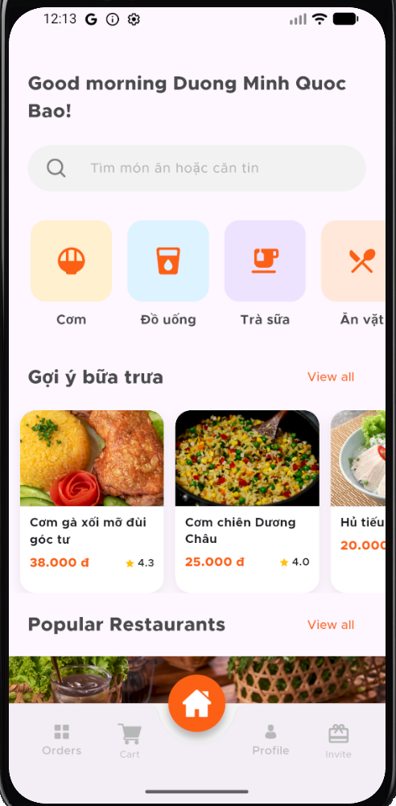 | 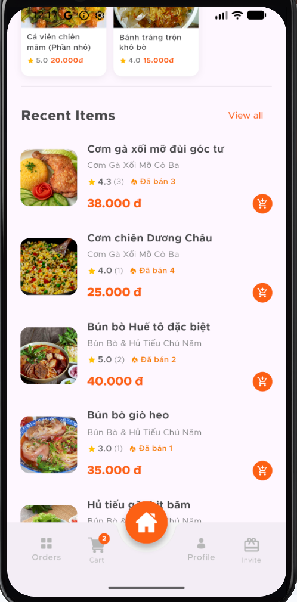 | 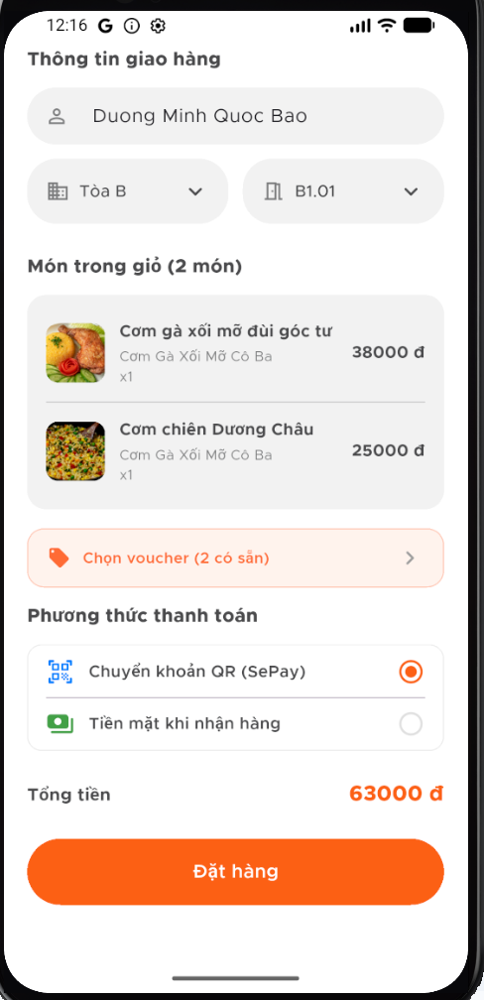 | 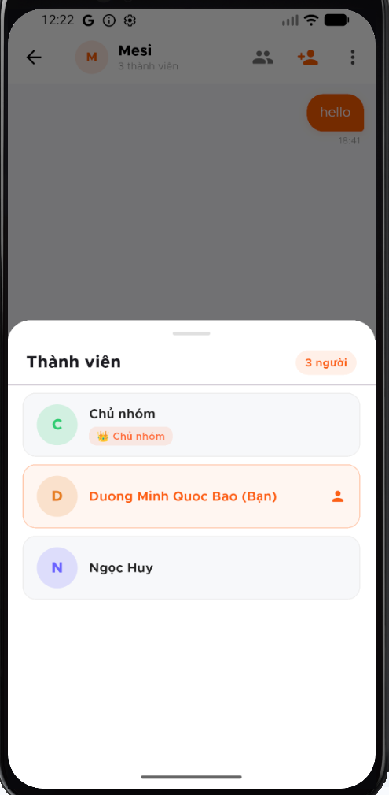 | 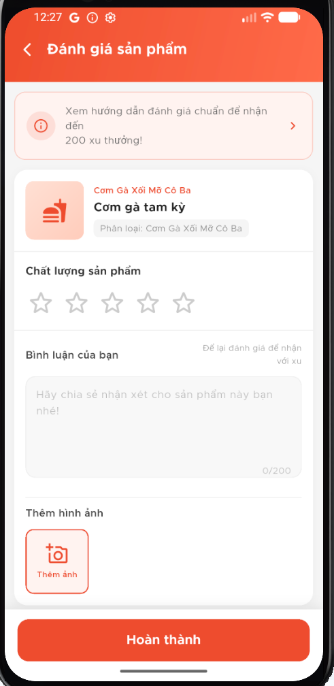 |

### 2. Dành cho Nhà Bếp & Shipper
| Chuẩn bị món (KDS View) | Quản lý thực đơn | Màn hình Giao hàng (Shipper) |
| :---: | :---: | :---: |
| 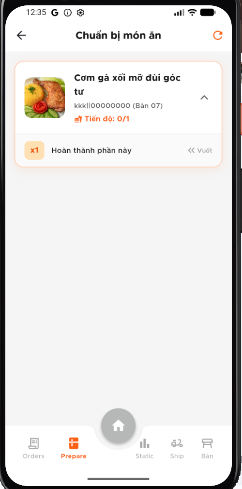 | 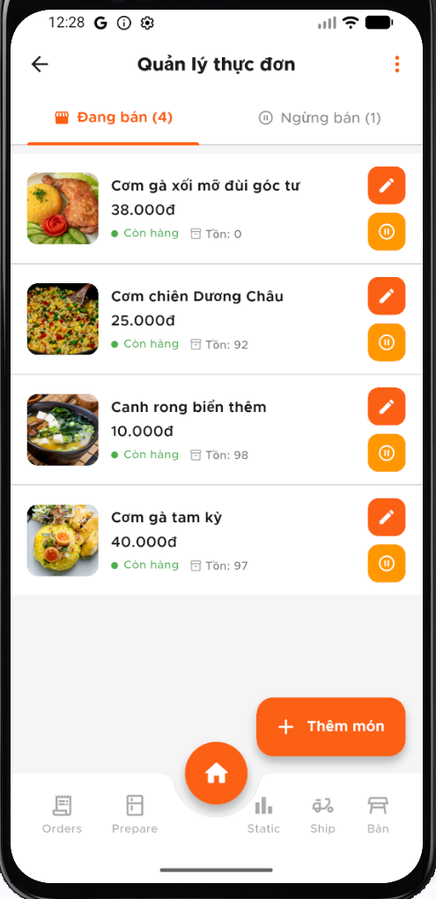 | 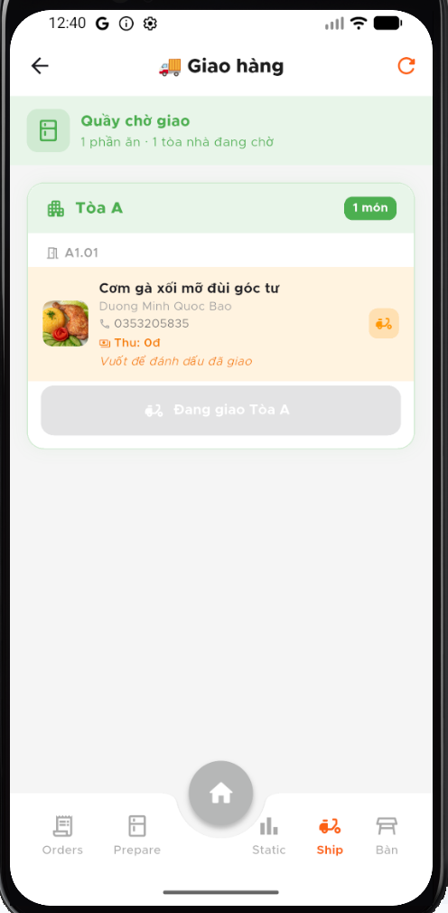 |

### 3. Phân hệ Admin (Quản trị hệ thống)
| Bảng điều khiển & Thống kê | Biểu đồ doanh thu | Quản lý gian hàng |
| :---: | :---: | :---: |
| 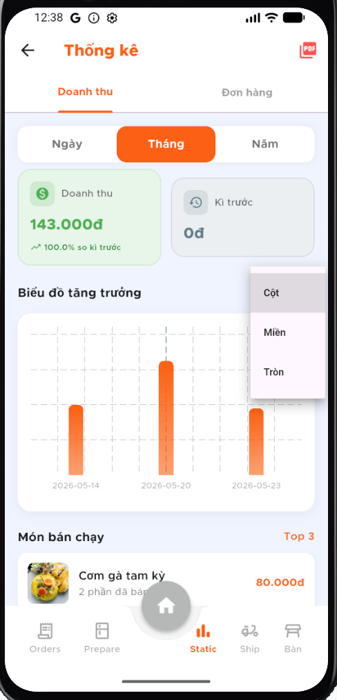 | 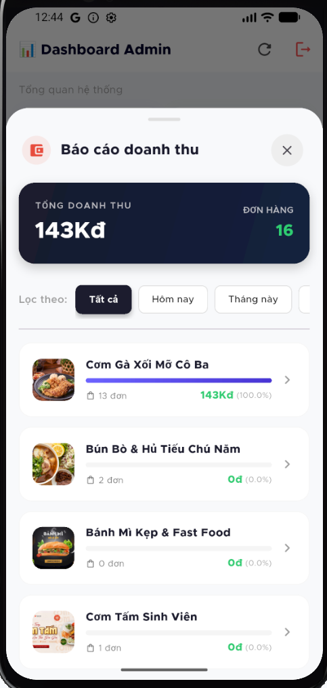 | 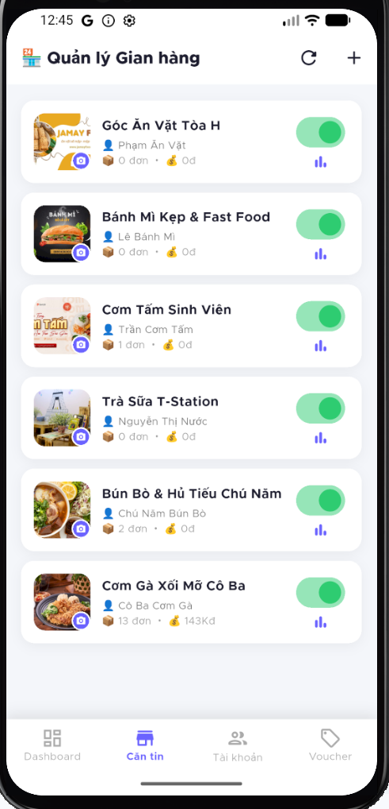 |

---

## 👥 Nhóm Tác Giả & Liên Hệ
* **Nhóm tác giả:** Trần Dũ Bảo & Dương Minh Quốc Bảo
* **Trường:** Trường Đại học Công nghiệp TP.HCM (IUH)
* **Môn học:** Công Nghệ Mới trong CNTT
* **Email:** [dubao1005@gmail.com](mailto:dubao1005@gmail.com)
* **Số điện thoại:** 0325176093
